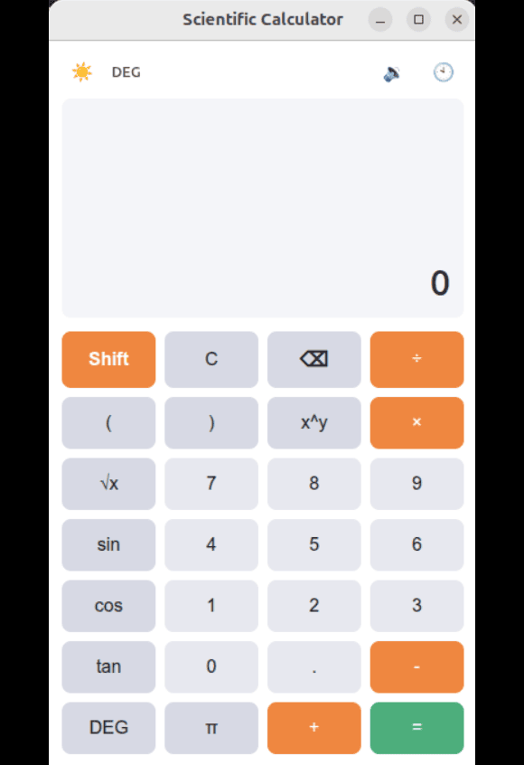
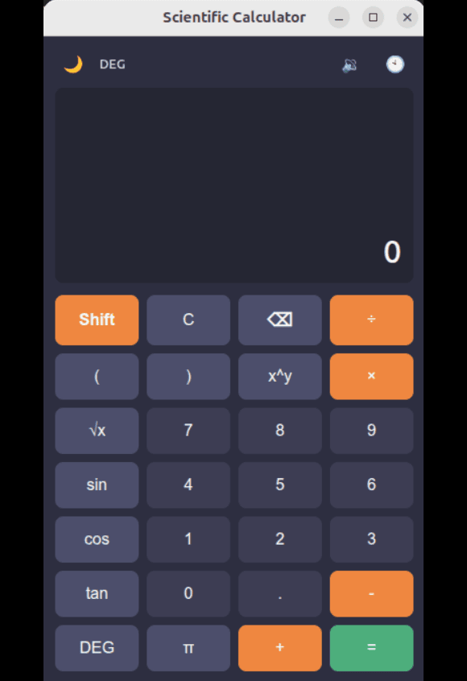

# Scientific Calculator

[](https://github.com/Shahriyar-Rahim/calculator-vanilla-electron/releases/latest)
[](#)
[](https://opensource.org/licenses/ISC)
[](https://snapcraft.io/scientific-calculator)

A native desktop scientific calculator built with Electron. It is designed to feel fast, lightweight, and familiar while offering a rich set of scientific and engineering tools for everyday use.

The project includes polished UI themes, keyboard shortcuts, calculation history, and cross-platform packaging for Windows, Linux, and macOS.

## Latest release

The current public release is v1.1.0 and is available from the GitHub Releases page.

- Windows: `.exe` installer and portable `.zip`
- Linux: `.deb` package and `.zip`
- macOS: `.zip`
- Snap package: available from Snap Store

Download the latest release here:

https://github.com/Shahriyar-Rahim/calculator-vanilla-electron/releases

## Features

- Scientific functions including sin, cos, tan, inverse trig, logarithms, powers, square roots, and constants
- Degree and radian modes
- Shift mode for secondary operations
- Calculus helpers such as integration, differentiation, absolute value, and summation
- Calculation history panel with quick recall
- Light and dark themes
- Optional sound feedback for button presses
- Clipboard copy/paste support
- Keyboard-first input for faster use
- Cross-platform desktop packaging via Electron

## Screenshots

| Light mode | Dark mode |
| :---: | :---: |
|  |  |

## Installation

### GitHub releases

1. Open the releases page:
   https://github.com/Shahriyar-Rahim/calculator-vanilla-electron/releases
2. Download the package that matches your platform.
3. Install it normally on your system.

### Linux via Snap

```bash
sudo snap install scientific-calculator
```

## Development

### Requirements

- Node.js
- npm

### Install dependencies

```bash
npm install
```

### Run locally

```bash
npm start
```

## Build and package

### Windows

```bash
npm run package-win
```

### Linux

```bash
npm run package-linux
```

### Create installers with Electron Forge

```bash
npm run make
```

This generates distributable artifacts for the configured platforms.

## Keyboard shortcuts

| Key | Action |
| :--- | :--- |
| 0-9 / . | Enter numbers and decimal values |
| + / - / * / / | Basic arithmetic operators |
| ^ | Power operation |
| Enter / = | Calculate result |
| Backspace | Delete last digit |
| Esc | Clear all |
| ( / ) | Parentheses |
| S / C / T | Sin / Cos / Tan |
| R | Square root |
| L | Logarithm |
| P | Pi |
| H | Toggle history |
| Ctrl + C | Copy result |
| Ctrl + V | Paste value |

## Project structure

- `main.js` — Electron main process and window setup
- `preload.js` — secure bridge for app communication
- `renderer/` — UI logic, views, and styles
- `assets/` — application images and icon assets
- `forge.config.js` — package and maker configuration

## License

This project is licensed under the ISC License.

## Author

Md. Shahriyar Rahim

- GitHub: https://github.com/Shahriyar-Rahim

## Release history

- v1.1.0 — current stable release
- v1.0.3 — maintenance update
- v1.0.2 — maintenance update
- v1.0.1 — initial packaged release
- v1.1.0-beta.1 — preview release

